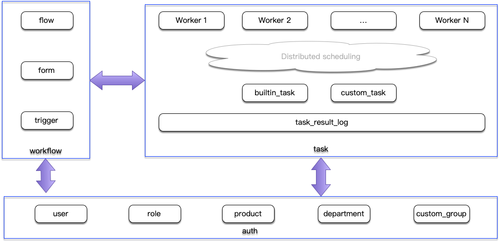

TalkingData eago
==========

Eago后台基于原内部平台需求重构而来。后台使用Go语言Go-Micro微服务架构开发。

Features：
----------

- auth：负责用户鉴权；主要功能包括登录、产品线管理、组织结构管理、自定义组管理、角色管理等。
  
- flow：工作流程模块；包括表单管理、流程管理、触发管理。用户可依据表单引擎生成表单、设计流程并配置指定条件下触发task模块发起任务。  

- task：任务模块；任务模块允许用户自定义任务、查看执行日志和配置计划任务。任务类型包括内建任务（如：发送通知等），自定义任务中用户可编写上传脚本让系统执行。  

